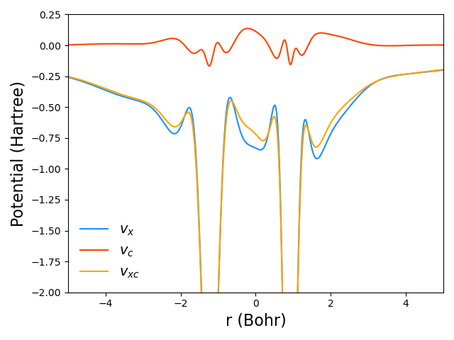
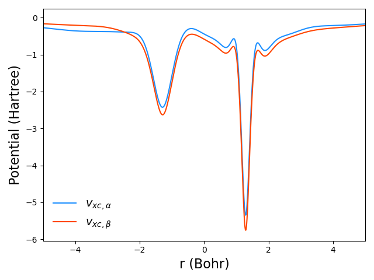

## SCRPA and USCRPA programs


The `SCRPA` and `USCRPA` programs allow spin-restricted and spin-unrestricted self-consistent random phase approximation (RPA) calculations.

---

**NOTE:** We have tutorial which provides practical Hands-on examples about the use of `SCRPA` and `USCRPA` programs and post-processing of results of calculations. This tutorial is a good supplement to this documentation. [Link to Tutorial](https://github.com/EgorTrushin/tutorials/blob/main/RPA_OEP.ipynb)

---

To obtain numerically stable potentials using optimized effective potential method (OPM), one must either use regularization techniques to carefully handle the small eigenvalues of the response matrix or to use auxiliary basis sets that are balanced to the orbital basis set. The latter can be done by manually constructing specific orbital and auxiliary basis sets that are sufficiently balanced. This has been possible for a number of atoms and molecules with quite large orbital basis sets [1], but does not qualify as a general applicable routine approach. The `SCRPA` and `USCRPA` programs therefore contain a new preprocessing scheme for auxiliary basis sets that effectively removes linear combinations of auxiliary basis functions that couple poorly to products of occupied times unoccupied Kohn-Sham orbitals and enable the construction of numerically stable exchange potentials with standard basis sets [2].

The preprocessing step to remove linear combinations of auxiliary basis functions that couple poorly to products of occupied times unoccupied Kohn-Sham orbitals is implemented according to Sec II5 of Ref. [2]. It involves the threshold **thr_fai_oep**, which determines how many linear combinations of auxiliary basis functions are removed and varies with respect to the size of the orbital basis set used. In Ref. [2], this scheme was tested using Dunning correlation consistent basis sets and recommended thresholds are

| aug-cc-pwCVXZ (X=T,Q,5) orbital basis sets | **thr_fai_oep** |
| :----: | :----:  |
| T      |  5d-2   |
| Q      | 1.7d-2  |
| 5      |  5d-3   |

These thresholds are expected to work also for orbital basis sets without augmentation cc-pwCVXZ (X=T,Q,5) and without core-polarization functions aug-cc-pVXZ (X = T, Q, 5). As an auxiliary basis set (OEP), the aug-cc-pVXZ/mp2fit (X = T, Q, 5) family of basis sets works best. In particular, according to Ref. [2], it is recommended to use aug-cc-pVDZ/mp2fit auxiliary basis sets for atoms up to neon and aug-cc-pVTZ/mp2fit auxiliary basis sets for heavier atoms.

Below is an example input file for spin-restricted calculations for the CO molecule. Note that the input record from a preceding calculation is mandatory for initialization of orbitals and eigenvalues as starting point for RPA calculation, whereas it can come from HF or DFT calculations with maxit=0.
```
gdirect ! integral-direct mode

basis={
default,aug-cc-pwCVQZ ! orbital basis
set,ri;default,aug-cc-pwCVQZ/mp2fit ! RI BASIS
set,oep;default,aug-cc-pVDZ/mp2fit ! OEP basis
}

symmetry,nosym ! SCRPA does not use symmetry

angstrom
geometry={
2

C        0.000000    0.000000   -0.646514 
O        0.000000    0.000000    0.484886 
}

df-hf,maxit=0,df_basis=aug-cc-pwCV5Z/mp2fit ! HF calculation with 0 iteration
{cfit,basis_coul=aug-cc-pwCV5Z/mp2fit,basis_exch=aug-cc-pwCV5Z/mp2fit}

acfd;scrpa,thr_fai_oep=1.7d-2 ! SCRPA calculation
```
As well as an example of a spin-unrestricted calculation for the BeF molecule:
```
gdirect ! integral-direct mode

basis={
default,aug-cc-pwCVQZ ! orbital basis
set,ri;default,aug-cc-pwCVQZ/mp2fit ! RI BASIS
set,oep;default,aug-cc-pVDZ/mp2fit ! OEP basis
}

symmetry,nosym ! USCRPA does not use symmetry

angstrom
geometry={
2

Be    0.0000000    0.0000000   -0.6823625 
F     0.0000000    0.0000000    0.6823625 
}

spin=1

df-uhf,maxit=0,df_basis=aug-cc-pwCV5Z/mp2fit ! HF calculation with 0 iterations
{cfit,basis_coul=aug-cc-pwCV5Z/mp2fit,basis_exch=aug-cc-pwCV5Z/mp2fit}

acfd;uscrpa,thr_fai_oep=1.7d-2 ! USCRPA calculation
```
The following options are available for the `SCRPA` and `USCRPA` programs:

- **orb** record from which the orbital coefficients and eigenvalues are read (default: ‘2100.2’ and ‘2200.2’ for `SCRPA` and `USCRPA`, respectively)  
- **save** record in which the resulting orbital coefficients, eigenvalues, etc. are written (default: '2101.2' and '2201.2' for `SCRPA` and `USCRPA`, respectively)  
- **dfit** if set to $\neq$ 0, enable density fitting for two-electron integrals (default: ’1’)  
- **maxit** maximum number of iterations (default '30')  
- **minit** minimum number of iterations (default '3')  
- **maxdiis** maximum size of the DIIS history (default '10')  
- **fixmix** if set to $\neq$ 0, switch from DIIS to linear mixing scheme with fixed mixing ratio. This may be useful for converging systems with a small HOMO-LUMO gap where DIIS may have problems. (default '0')  
- **mixrate** mixing rate for linear mixing scheme, corresponds to the fraction of the old Fock matrix in the new step (default '0.95d0')  
- **energy** threshold for energy convergence (default: '1d-8')  
- **density** threshold for density convergence (default: '0d0')  
- **thr_sym** threshold for symmetrization of the OEP basis set to enforce OEP basis exhibits full symmetry of molecule. Set the threshold to 1d-10 to enable symmetrization. (default: ‘0d0’)  
- **thr_overlap_oep** threshold for processing OEP basis according to Section IIB2 in Ref. [2] (default: ‘1d-99’)  
- **thr_fai_oep** threshold for processing OEP basis according to Section IIB5 in Ref. [2] (default: ‘1.7d-2’)  
- **thr_oep** threshold for throwing out contributions corresponding to small eigenvalue differences appearing in the denominator when constructing the so-called lambda term $1/(\varepsilon_a - \varepsilon_i)$ of the static Kohn-Sham response function (default: ‘1d-6’)  
- **thr_overlap_ri** threshold for processing RI basis according to Section IIB2 in Ref. [7] (default: ‘1d-99’)  
- **thr_fai_ri** threshold for processing RI basis according to Section IIB5 in Ref. [7] (default: ‘1d-14’)  
- **thr_rpa** threshold for throwing out contributions corresponding to small eigenvalue differences during construction of the response function (default: ‘1d-6’)  
- **solve** matrix inversion methods to solve the OEP equation. The different options are: GESV, TSVD, GTSVD. GESV corresponds to a direct solution without any regularization technique. TSVD and GTSVD correspond to two solutions with regularization according to Eqs. (55) and (56) of Ref. [3], respectively. (default: 'GTSVD')  
- **thr_solve** threshold used during matrix inversion to solve the OEP equation with TSVD and GTSVD methods. Note that the default threshold of 1d-99 results in the absence of regularization (default: ‘1d-99’)  
- **nquadint** number of logarithmically spaced intervals for frequency integration (default ‘1’)
- **nquad** number of points per interval for frequency integration (default '20')
- **w0** caling factor for rational the function mapping the Gauss–Legendre quadrature for the interval [−1, 1] to the interval [0, ∞], see Eqs. 37-38 in Ref. [4] for details (default: ‘2.5’)
- **vc_scal** scaling factor for the Coulomb kernel, which can be used to mimic the effect of the inclusion of the exact-exchange kernel. In the special case of non-spin-polarized two-electron systems, the RPA calculation with a Coulomb kernel scaled by 1/2 is equivalent to including of the exact-exchange kernel. Implemented only in `SCRPA` (default: ‘1d0’)
- **vref_fa** if set to $\neq$ 0, enable the use of the Fermi-Amaldi potential as reference potential. Otherwise, the reference potential is constructed according to Eq. (45) of Ref. [2] (default: '1')  
- **vhoep** if set to $\neq$ 0, enable the calculation of the Hartree potential from the representation in the OEP basis instead of the construction from the density matrix as in the Hartree-Fock calculation (default: ‘0’)
- **space_sym** if set to $\neq$ 0, enable the space-symmetrization. When active sets vhoep=1 thr_sym=1d-10. (default: '0d0')
- **homo** if set to $\neq$ 0, enable the use of the HOMO condition for the exchange potential (default '1')  
- **plot_always** if set to $\neq$ 0, enable writing of data-files for plotting for every iteration. Otherwise, only final results are written. (default: '0')  
- **plot_x** if set to $\neq$ 0, enable writing of file with plotting data for exchange and correlation potentials along x-axis (default: '0')
- **plot_y** if set to $\neq$ 0, enable writing of file with plotting data for exchange and correlation potentials along y-axis (default: '0')
- **plot_z** if set to $\neq$ 0, enable writing of file with plotting data for exchange and correlation potentials along z-axis (default: '0')
- **test_pot** if set to $\neq$ 0, enable a numerical test to determine if the potential is the derivative of the energy expression (default ’0’)  
- **verb** determines the level of verbosity in the output file, integer values of 0, 1, 2, and 3 provide different levels of verbosity (default ’0’)  

The following parameters are only relevant for the `USCRPA` code:
- **spin_sym** if set to $\neq$ 0, enable spin-symmetrization in spin-unrestricted calculations, forcing orbitals and eigenvalues in $\alpha$ and $\beta$ spin channels to be identical (default: ‘0’)
- **vref_fa_sameab** if set to $\neq$ 0, force the Fermi-Amaldi reference potential to be the same for $\alpha$ and $\beta$ spin channels (default: ‘0’)

Pitfalls:
- One might encounter convergence problem using DIIS for systems exhibiting small HOMO-LUMO gaps. In this case switching to linear mixing scheme often might resolve the problem.
 - One might sometimes encounter energy oscillations between two solutions with different numbers of OEP basis functions remaining after OEP basis set preprocessing.  A small change in **thr_fai_oep** may solve the problem.

Since the local exchange and correlation potentials are important in self-consistent RPA calculations, we provide an illustration of how to plot these potentialsLet us assume that we have performed calculations for CO with the following options:
```
acfd;scrpa,thr_fai_oep=1.7d-2,plot_z=1
```
At the end one has the files vx-final.z and vc-final.z with data for exchange and correlation potentials. The potentials can be plotted using Python and matplotlib as follows:
```python
import numpy as np
import matplotlib.pyplot as plt

def load_potential(potfile):
    """Read data from potential-file.

    Args:
      potfile: Path to file with potential data.

    Returns:
      x: x coordinate.
      y: y coordinate.
      z: z coordinate.
      coord: coordinate on path.
      vref: reference potential.
      vrest: rest potential.
      v: full potential.
    """
    x, y, z, coord = list(), list(), list(), list()
    vref, vrest, v = list(), list(), list()
    for line in open(potfile):
        aux = line.split()
        x.append(float(aux[1]))
        y.append(float(aux[2]))
        z.append(float(aux[3]))
        coord.append(float(aux[4]))
        vref.append(float(aux[6]))
        vrest.append(float(aux[7]))
        v.append(float(aux[8]))
    x, y, z, coord = np.array(x), np.array(y), np.array(z), np.array(coord)
    vref, vrest, v = np.array(vref), np.array(vrest), np.array(v)
    return x, y, z, coord, vref, vrest, v

_, _, _, coord, vxref, vxrest, vx = load_potential('vx-final.z')
_, _, _, coord, _, _, vc = load_potential('vc-final.z')

plt.plot(coord, vx, color='dodgerblue', label='$v_x$')
plt.plot(coord, vc, color='orangered', label='$v_c$')
plt.plot(coord, vx+vc, color='orange', label='$v_{xc}$')

plt.ylabel('Potential (Hartree)', fontsize=16)
plt.xlabel('r (Bohr)', fontsize=16)
plt.ylim(-2, 0.25)
plt.xlim(-5, 5)
plt.legend(frameon=False, fontsize=14)
plt.tight_layout()
plt.show()
```


In the similar way, for spin-unrestricted calculations with `USCRPA`, one ends up with four files vxa-final.z, vxb-final.z, vca-final.z, vcb-final.z with data for $\alpha$ and $\beta$ spin channels. For BeF one obtains:
```python
import numpy as np
import matplotlib.pyplot as plt

def load_potential(potfile):
    """Use function from example with CO."""
    pass

_, _, _, coord, _, _, vxa = load_potential('vxa-final.z')
_, _, _, coord, _, _, vca = load_potential('vca-final.z')

_, _, _, coord, _, _, vxb = load_potential('vxb-final.z')
_, _, _, coord, _, _, vcb = load_potential('vcb-final.z')

plt.plot(coord, vxa+vca, color='dodgerblue', label=r'$v_{xc,\alpha}$')
plt.plot(coord, vxb+vcb, color='orangered', label=r'$v_{xc,\beta}$')

plt.ylabel('Potential (Hartree)', fontsize=16)
plt.xlabel('r (Bohr)', fontsize=16)
plt.xlim(-5, 5)
plt.legend(frameon=False, fontsize=14)
plt.tight_layout()
plt.show()
```


**Bibilography:**  
[1] A. Heßelmann, A.W. Götz, F. Della Sala, A. Görling [J. Chem. Phys.](https://doi.org/10.1063/1.2751159) 127, 054102 (2007)  
[2] E. Trushin, A. Görling, [J. Chem. Phys.](https://aip.scitation.org/doi/full/10.1063/5.0056431) 155, 054109 (2021)  
[3] P. Bleiziffer, A. Heßelmann, A. Görling [J. Chem. Phys.](https://doi.org/10.1063/1.4818984) 139, 084113 (2013)
